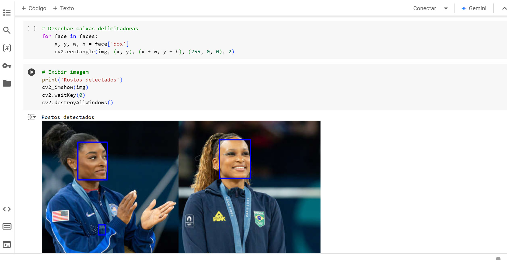

# Criando um Sistema de Reconhecimento Facial do Zero

No desafio do sexto módulo do Bootcamp BairesDev - Machine Learning Practitioner promovido pela DIO chamado "Criando um Sistema de Reconhecimento Facial do Zero" foram criados projetos com as bibliotecas e frameworks estudados. O objetivo foi criar um sistema de detecção e reconhecimento de faces. O código foi feito em Python no ambiente COLAB e os arquivos criados são:

- Modulo6YOLO
- Modulo6_SSD
- Modulo6_OpenCV
- Modulo6_MTCNN

Bibliotecas utilizadas:

- Torch
- Torchvision
- Matplotlib
- PIL
- MTCNN
- Yolo
- OpenCV

## OpenCV

O **OpenCV (Open Source Computer Vision Library)** é uma biblioteca de código aberto voltada para visão computacional e processamento de imagens. Ela fornece uma vasta coleção de algoritmos e ferramentas que permitem a manipulação de imagens e vídeos, além de análise e reconhecimento de padrões. Desenvolvida inicialmente pela Intel, atualmente é amplamente usada em áreas como visão computacional, machine learning e robótica.

## SSD

Refere-se ao **Single Shot Multibox Detector**, um modelo de deep learning usado para detecção de objetos em imagens ou vídeos. O SSD é um algoritmo rápido e eficiente, pois faz a detecção de objetos em um único passo ("single shot"), ao contrário de arquiteturas mais antigas como o R-CNN, que têm várias etapas. Implementações do SSD podem ser encontradas em frameworks como PyTorch ou TensorFlow.

## MTCNN

**MTCNN (Multi-Task Cascaded Convolutional Neural Network)** é um modelo de visão computacional projetado para detecção de rostos e extração de marcos faciais (facial landmarks) em imagens ou vídeos. Ele é amplamente utilizado em aplicações como reconhecimento facial, análise de expressões e sistemas de autenticação.

## YOLO

**YOLO (You Only Look Once)** é uma técnica de visão computacional projetada para tarefas de detecção de objetos em tempo real. Ela identifica e localiza múltiplos objetos em uma imagem ou vídeo com alta velocidade e precisão, tornando-a uma das arquiteturas mais populares em aplicações como vigilância, veículos autônomos e sistemas de monitoramento. A detecção é realizada em uma única etapa (daí o nome "You Only Look Once").Diferente de métodos tradicionais (como R-CNN), o YOLO não divide a imagem em regiões de interesse, analisando-a como um todo.
